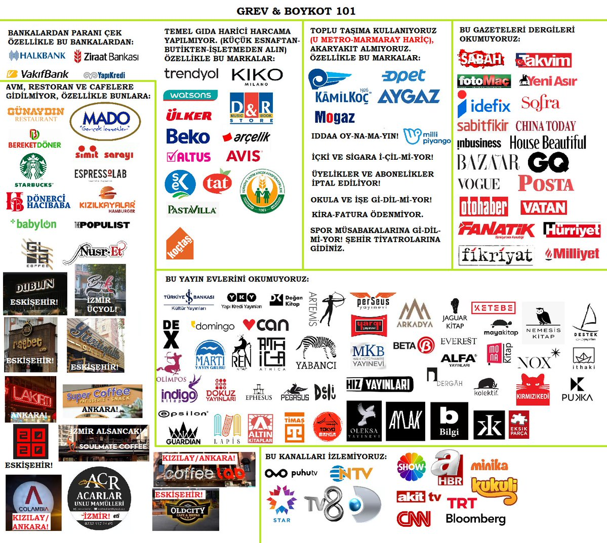

# Boykot

## Boykot Nedir?

Boykot nedir? Boykot, bir kuruluşun spesifik politika ve davranışları değişene kadar kadar hiçbir ürün ve hizmetini kullanmayarak ekonomik **baskı** yaratma eylemidir.

Boykotun amacı;

1. Talebi Düşürmek
    Boykot edilen ürün ya da markaya olan talep azaldığı zaman şirketin geliri düşer, kar marjı azalır, hissedar güveni sarsılır. 
2. Pazar gücünü etkilemek 
    Bu firmaların pazardakı yerleri sarsıldıkça ekonomik kayıplar yaşamamak adına polıtıkalarını değiştirmek zorunda kalırlar. 

    Özellikle global firmalara yönelık boykotlar, bu şirketlerın pazardan çekilmesine veya operasyonlarını durdurmasına yol açabilir. Dış gelirleri doğrudan etkileyen bu durum, hükümetin protestolara karşı tutumunu değiştirmesinde belirleyici bir faktör olacaktır. 

Boykot edilen markaların, kanmamanız gereken taktikleri:

- Fiyatları düşürmek
- Özür kampanyası (yanlış anlaşıldıklarını iddia etme, sosyal sorumluluk projeleri duyurma)
- Ünlülere reklam / imaj tazeleme
- Yeni yan markalar açma (rebranding)
- Milliyetçi veya dini değerlere hitap eden kampanyalar yapma (duygusal manipülasyon)
- Ürünlere yeni ambalaj / farklı isim

## Boykot Edilen Markalar

bkz. [boykot.web.tr](https://boykot.web.tr) - Boykot sitesi

## Alternatifleri

